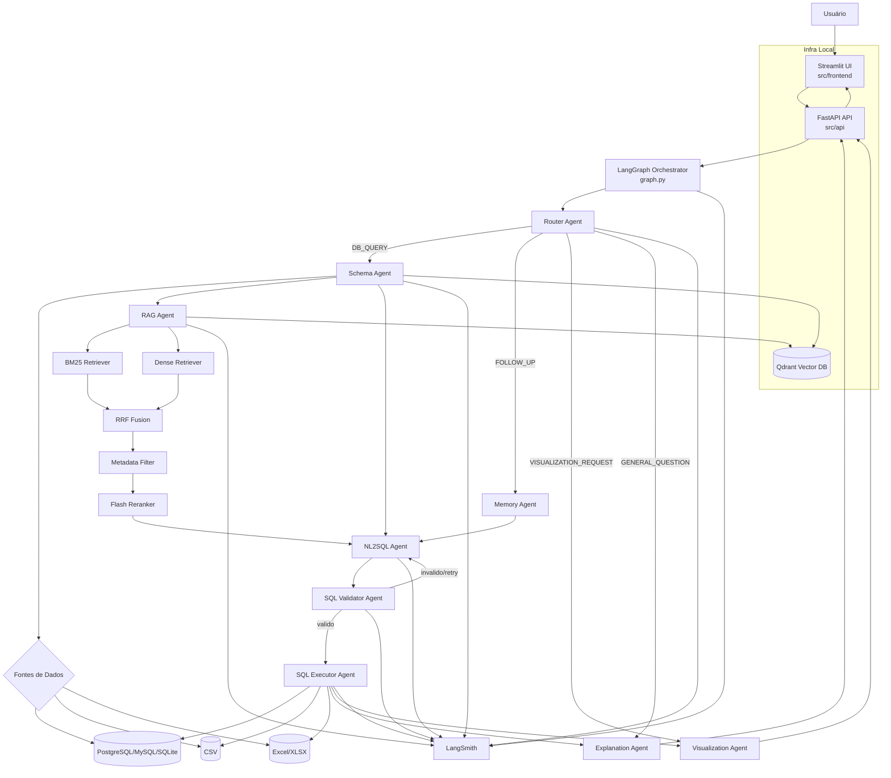

# 🤖 Agente Text-to-SQL com LangGraph + RAG Avançado

Sistema de agentes de IA para conversão de linguagem natural em SQL (Text-to-SQL), utilizando arquitetura RAG avançada com múltiplos agentes orquestrados via LangGraph.

---

## 🎯 Sobre o Projeto

Este projeto é uma **Prova de Conceito (POC)** que demonstra a capacidade de agentes de IA em interpretar perguntas em linguagem natural e gerar consultas SQL automaticamente. O sistema suporta múltiplas fontes de dados e utiliza uma arquitetura avançada de RAG (Retrieval-Augmented Generation) para melhorar a precisão das consultas geradas.

### Principais Capacidades

- 📝 Interpretação de perguntas em português e inglês
- 🔄 Geração automática de SQL para múltiplas fontes de dados
- 💬 Suporte a perguntas de acompanhamento (follow-ups)
- 📊 Geração automática de visualizações (gráficos)
- 🔍 Recuperação semântica avançada com BM25 + Dense Retrieval
- 🛡️ Validação e segurança nas consultas SQL
- 📈 Observabilidade completa via LangSmith

---

## ✨ Funcionalidades

| Funcionalidade | Descrição |
|----------------|-----------|
| **NL2SQL** | Converte perguntas naturais em consultas SQL precisas |
| **Multi-Fonte** | Suporta PostgreSQL, MySQL, SQLite, CSV e Excel |
| **RAG Avançado** | Pipeline com BM25, Dense Retrieval, RRF e Flash Reranker |
| **Follow-ups** | Mantém contexto para perguntas sequenciais |
| **Visualização** | Gera gráficos automáticos (barras, linhas, pizza) |
| **Validação** | Guardrails para segurança e qualidade do SQL |
| **Observabilidade** | Rastreamento completo via LangSmith |

---

## 🤖 Agentes

O sistema é composto por **9 agentes especializados**, cada um com uma função específica dentro do workflow.

| Agente | Função |
|--------|---------|
| **Router Agent** | Classifica a intenção da pergunta (DB_QUERY, GENERAL_QUESTION, FOLLOW_UP, VISUALIZATION) |
| **Schema Agent** | Extrai e indexa esquemas de bancos de dados |
| **RAG Agent** | Executa o pipeline de recuperação semântica |
| **NL2SQL Agent** | Gera consultas SQL a partir da pergunta |
| **SQL Validator** | Valida sintaxe, segurança e boas práticas SQL |
| **SQL Executor** | Executa queries em diferentes fontes de dados |
| **Explanation Agent** | Transforma resultados em linguagem natural |
| **Visualization Agent** | Gera gráficos automaticamente |
| **Memory Agent** | Mantém contexto para conversas contínuas |

---

## Pipeline de Recuperação Híbrida

```text
┌─────────────┐     ┌─────────────┐     ┌─────────────┐
│   BM25      │     │   Dense     │     │   Metadata  │
│  (Lexical)  │     │ (Semântico) │     │   Filter    │
└──────┬──────┘     └──────┬──────┘     └──────┬──────┘
       │                   │                   │
       └───────────────────┼───────────────────┘
                           ▼
                    ┌─────────────┐
                    │    RRF      │
                    │   Fusion    │
                    └──────┬──────┘
                           ▼
                    ┌─────────────┐
                    │   Flash     │
                    │  Reranker   │
                    └──────┬──────┘
                           ▼
                    ┌─────────────┐
                    │   Context   │
                    │   Final     │
                    └─────────────┘
```
---

## 🏗️ Arquitetura



---

## 🛠️ Tecnologias

### Core
- **LangGraph** - Orquestração de agentes
- **LangChain** - Framework LLM
- **FastAPI** - Backend API
- **Streamlit** - Interface do usuário

### RAG & Vector Store
- **Qdrant** - Banco de dados vetorial
- **Sentence-Transformers** - Embeddings locais
- **BM25** - Busca lexical
- **Rank-BM25** - Fusão de rankings

### Banco de Dados
- **SQLAlchemy** - ORM e conexões SQL
- **Pandas** - Manipulação de dados
- **DuckDB** - Execução SQL em arquivos
- **OpenPyXL** - Leitura de Excel

### Visualização & Observabilidade
- **Plotly** - Gráficos interativos
- **LangSmith** - Rastreamento e monitoramento

---

## 🚀 Instalação

### Pré-requisitos

- Python 3.9+
- Docker e Docker Compose
- Chave de API OpenAI
- Chave de API LangSmith (opcional, para observabilidade)
